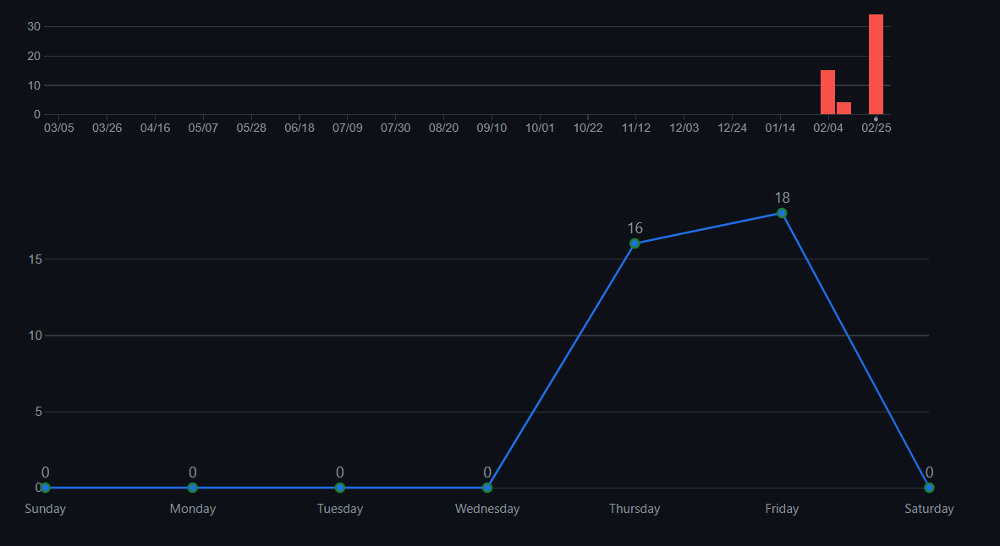
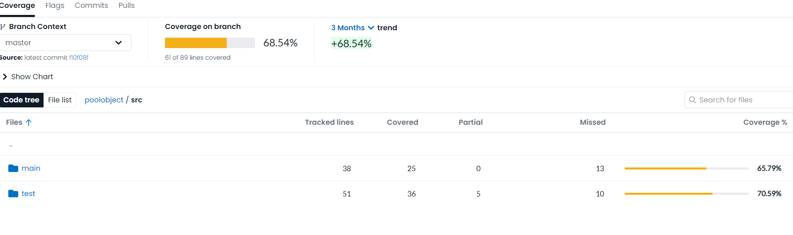
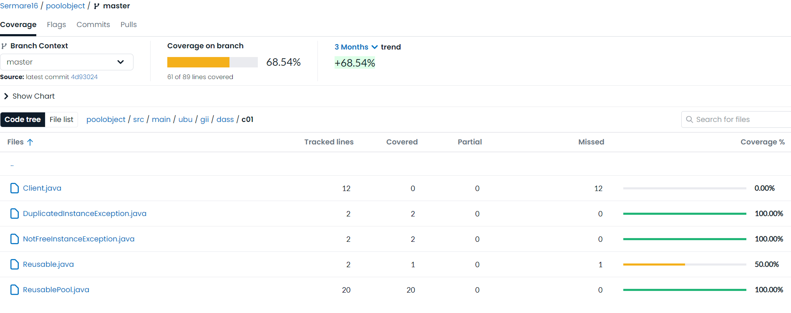
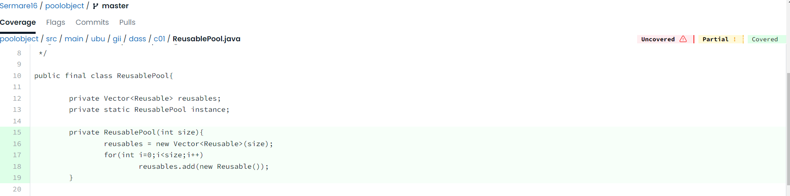
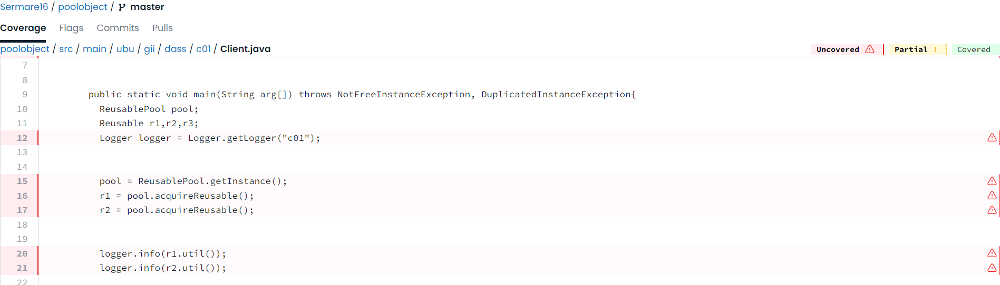
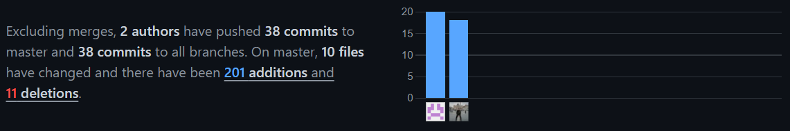
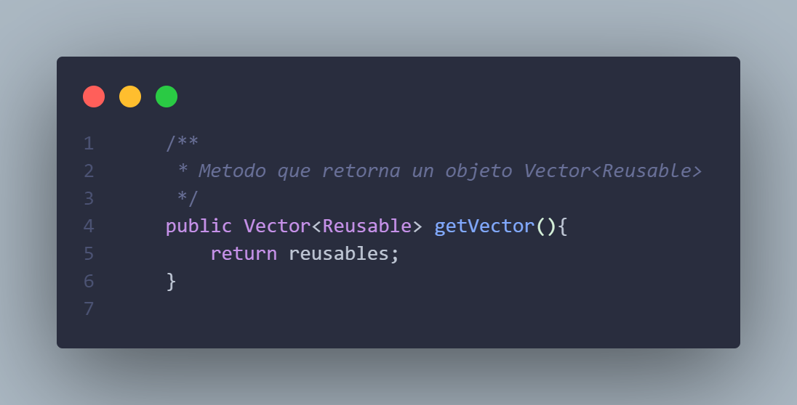
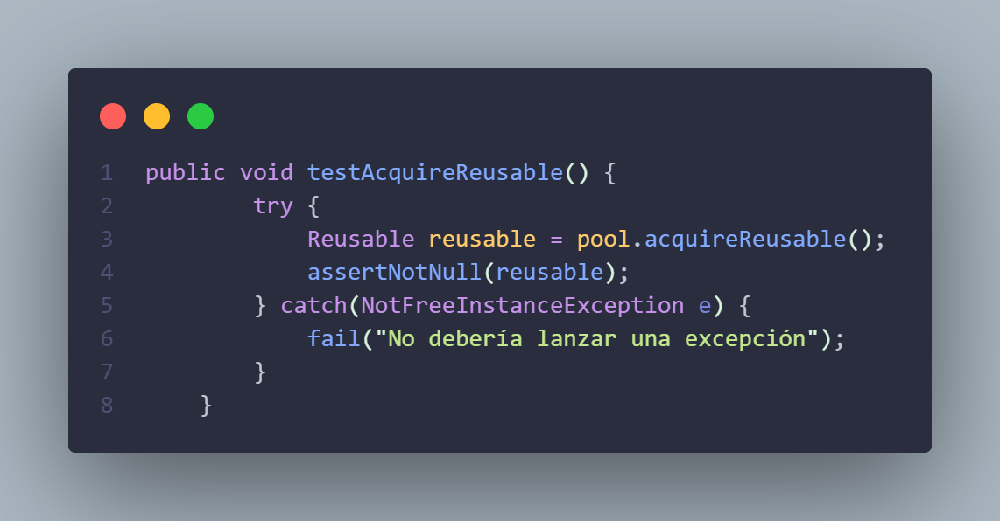

poolobject
==========

 
 

Java code example of creational design pattern pool object

Workshop to use good practices in software development: testing, ci and measurement.

Authors:

- Carlos Lopez Nozal
- Jesus Alonso Abad
- Sergio Martín Reizábal
- Javier Pampliega García

# **INDICE**
-   [Introducción](#introducción)
-   [Objetivos](#objetivos)
-   [Preguntas](#preguntas)
    -   [¿Se ha realizado trabajo en equipo?](#¿se-ha-realizado-trabajo-en-equipo)
    -   [¿Tiene calidad el conjunto de pruebas disponibles?](#¿tiene-calidad-el-conjunto-de-pruebas-disponibles)
    -   [¿Cuál es el esfuerzo invertido en realizar la actividad?](#¿cuál-es-el-esfuerzo-invertido-en-realizar-la-actividad)
    -   [¿Cuál es el número de fallos encontrados en el código original?](#¿cuál-es-el-número-de-fallos-encontrados-en-el-código-original)
    -   [¿El proceso de integración continua realizado ha sido de calidad?](#¿el-proceso-de-integración-continua-realizado-ha-sido-de-calidad)

# **Introducción**
En esta practica el objetivo ha sido la creacion de pruebas unitarias, asi como, la implementacion de un sistema de integración continua empleando la herramienta GitHub Actions. Se ha empleado como herramienta de medición de calidad basada en el cubrimiento de código, la herramienta Codecov.

# **Objetivos**
-   Comprender los objetivos de medición relacionados con la caracterización y la evaluación de productos, procesos y recursos software.
-   Comprender, aplicar y analizar técnicas de medición sobre entidades de productos software relacionados con conjuntos de pruebas de software.
-   Comprender, aplicar y analizar medidas relacionadas sobre entidades de proceso y recursos de prueba del software.

# **Preguntas**

## **¿Se ha realizado trabajo en equipo?**
Si, se ha realizado el trabajo en equipo. Esto se puede comprobar accediendo al historial de commits del propio repositorio. Entre ambos compañeros se han realizado las distintas tareas solicitadas. Ademas, la implementación de los tests se han hecho de forma conjunta y consultando las ideas a implementar entre ambos.
A continuacion se adjunta una imagen con la grafica de commits:

## **¿Tiene calidad el conjunto de pruebas disponibles?**
Si, el conjunto de pruebas disponibles tiene calidad. Para entender esto, se va a definir el concepto cobertura de codigo: se define como una metrica empleada en pruebas software que nos permite medir el grado en el que el codigo fuente de un producto software ha sido probado. Teniendo en cuenta el concepto anterior, podemos decir que el codigo fuente de nuestro producto cuenta con un 69% de cobertura según la herramienta Codecov. Si accedemos a los informes que nos proporciona dicha herramienta, podremos observar en porfundidad que partes de nuestro proyecto se encuentran cubiertas. A continuacion se adjuntan imagenes de los resultados:

Se puede profundizar mas consultando el codigo fuente. En el src de nuestro proyecto contamos con dos carpetas: main y test. En el main contamos con las distintas clases que componen el producto software, dichas clases tienen que ser probadas en pruebas unitarias con el fin de comprobar si sus funcionalidades actuarian de forma correcta cuando se requiriesen de ellas. Es por ello, que usando Codecov podemos comprobar la cobertura que le proporcionamos a estas clases. En nuestro caso la cobertura quedaria de la siguiente forma:

Se debe de tener en cuenta que se han realizado tests sobre el ReusablePool, asi como, las posibles excepciones que pueden llegar a lanzarse. Es por ello, que al no contemplarse Cliente el porcentaje de cobertura sea mas bajo de lo esperado.

A continuacion, se hara hincapie de como Codecov nos indica si hemos realizado la cobertura del codigo.

Se puede observar que el codigo aparece remarcado en verde, esto nos quiere decir que esa parte de codigo si que esta siendo cubierta por una prueba unitaria. En cambio, cuando una prueba unitaria no tiene en cuenta una parte del codigo, la remarcara en rojo.

## **¿Cuál es el esfuerzo invertido en realizar la actividad?**
La realización de esta práctica se ha llevado a cabo a través de distintas labores. Estas son la implementación de un sistema de integración continua, conexión con Codecov, creación de pruebas unitarias y redacción del informe. Todas estas tareas se han realizado en distintos dias, empleando un par de horas. A pesar de que la dificultad no haya sido elevada si que han surgido inconvenientes durante el desarrollo de la misma. Nos vimos forzados a abandonar temporalmente la realización de la práctica debido a la caida de los servicios de push y actions de GitHub. Por el resto, se puede decir que el esfuerzo empleado ha sido de unas 12-14 horas.

Otra forma de medir el esfuerzo dedicado podría ser a través de los commits. Estos nos aportan una valiosa información, que puede ser las lineas modificadas (tanto añadidas como borradas). A continuación se muestra la información sobre los commits:

## **¿Cuál es el número de fallos encontrados en el código original?**
En la realización de la práctica se han detectado distintos errores, que han dificultado un poco la creación de las pruebas unitarias. Se exponen a continuación los errores encontrados:

### **Atributos privados**
Como la clase ReusablePool sigue el patrón Singleton (solo se puede crear una instancia del objeto), tenemos que los atributos de la clase son privados. Este hecho dificulta el acceso a estos atributos desde otra clase. Como solución alternativa, hemos planteado la creación de un método "get" para consultar el atributo que requeriamos para la implementación de las pruebas unitarias.

### **Ausencia de versión JUnit 5**
La versión JUnit 5 incluye numerosos métodos assert que permiten comprobar distintos casos. Uno de ellos es el assertThrows, que nos permite comprobar el lanzamiento de excepciones, al contar con la version 4 de JUnit ya no disponemos con este metodo, por lo tanto, tenemos que plantear otra forma de comprobar el lanzamiento de excepciones. Para ello hemos empleado las estructuras try-catch, como por ejemplo:

## **¿El proceso de integración continua realizado ha sido de calidad?**
Sí, el proceso de integración continua ha sido de calidad. Esto se debe a que se ha empleado GitHub Actions para el uso de Workflows. También se han empleado prácticas como la automatización de pruebas, la construcción y despliegue automatizado, así como la integración con herramientas de revisión de código como Codecov para garantizar la calidad del código. Además, se ha empleado Java CI (Continuous Integration), lo que ha permitido automatizar tareas como la compilación del código, la ejecución de pruebas unitarias y de integración, y la generación de informes de cobertura de código. Esto ha contribuido a un flujo de trabajo claro y bien definido para la integración continua, lo que ha permitido una entrega más rápida y confiable de cambios al proyecto.

